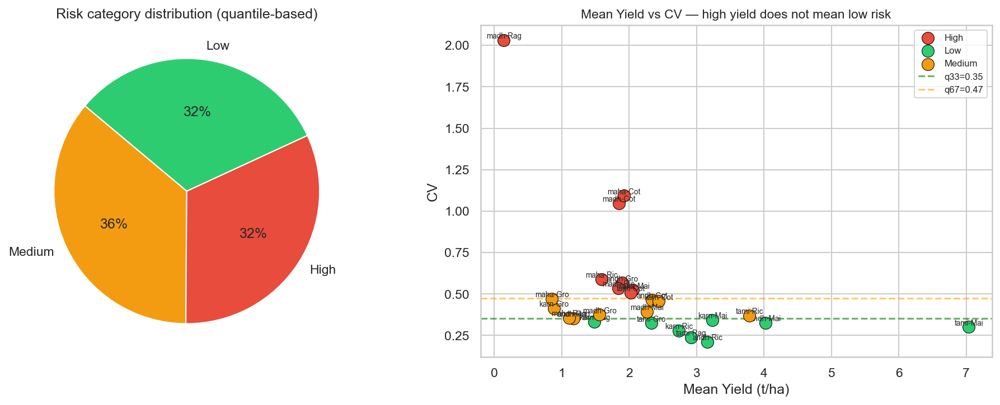
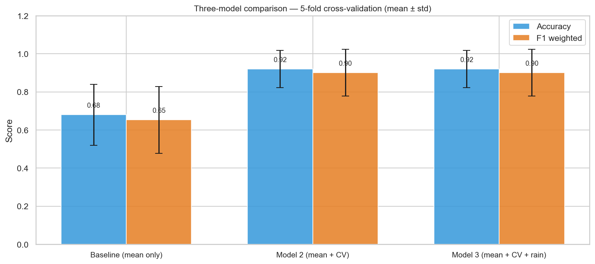
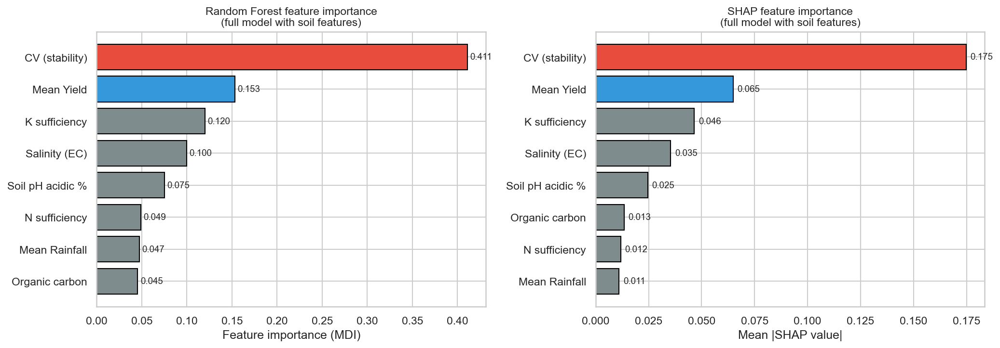

# AI in Agriculture: Crop Production Risk Prediction

A machine learning project that classifies crop production risk (Low / Medium / High) across Indian states using yield variability and rainfall data — built as part of academic research at MIT, MAHE.

## Overview
This project analyzes district-level yield data across **5 states × 5 crops (2012–2022)** to predict production risk categories using the **Coefficient of Variation (CV)** of yield as the core risk signal, combined with Random Forest classification.

## Tech Stack
- Python
- scikit-learn (Random Forest, cross-validation)
- pandas, NumPy
- SHAP (feature importance / model interpretability)

## Methodology

**Risk labeling:** Switched from fixed yield thresholds (which produced a skewed 22/2/1 class split) to **quantile-based thresholds (q33/q67)**, achieving a balanced ~32/36/32% split across Low/Medium/High risk classes.

The scatter plot on the right illustrates the core insight driving this project: **high mean yield does not imply low risk**. Some high-yield state-crop combinations still show high year-to-year variability (CV), and vice versa — which is why CV, not just average yield, was needed as a risk signal.

**Model comparison:**

| Model | Features | Accuracy |
|-------|----------|----------|
| M1 (Baseline) | Mean yield only | 68% |
| M2 | + Coefficient of Variation (CV) | 92% |
| M3 | + CV + rainfall | 92% |

**Validation:** 5-fold stratified cross-validation

**Interpretability:** SHAP values and Mean Decrease in Impurity (MDI) — both consistently show **CV as the dominant predictive feature**, well ahead of mean yield and soil indicators.

**Advisory layer:** Rule-based recommendations generated from predicted risk categories.

## Key Finding
Yield variability (CV) is a far stronger predictor of production risk than mean yield alone — incorporating it took model accuracy from 68% to 92%.

## Authors
- Akshaya C. Rao
- Rashmitha K.

School of Computer Engineering, Manipal Institute of Technology, MAHE

